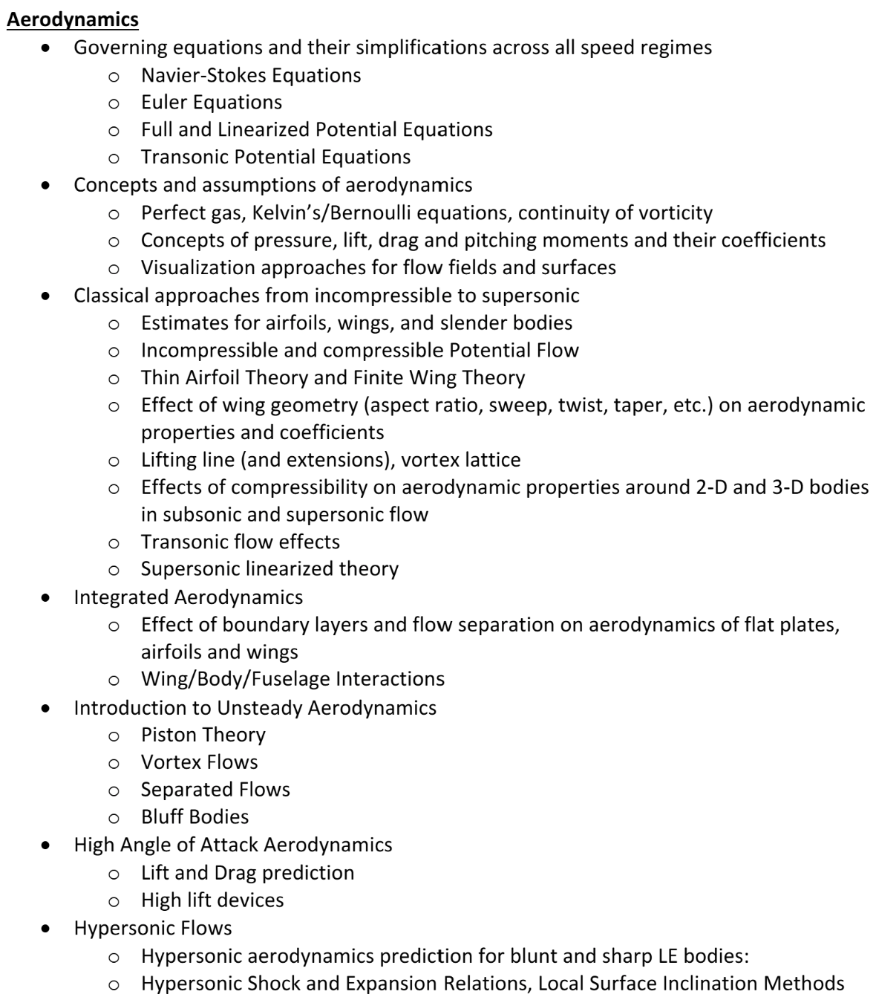
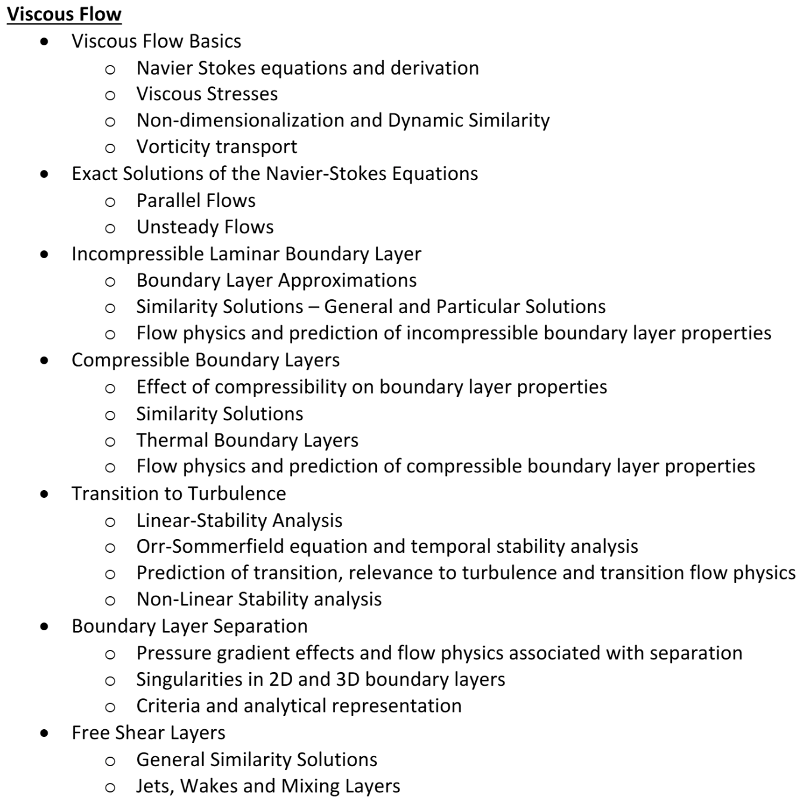

# Aerodyanmics Quals Study

# Aerodynamics

* [**Dr. Sankar Aero Website**](https://sankar.gatech.edu/?q=node/12#overlay-context=)

* [**Dr. Sankar Youtube**](https://www.youtube.com/@lakshmisankar6498/videos)

---

## Dr. Sankar Youtube Videos

### Prandtl's Lifting Line Theory

 [Lifting Line Theory pdf](https://www.sankar.gatech.edu/sites/default/files/Lifting_Line_Theory.pdf)

1. [Video - Lifting Line Theory 1](https://www.youtube.com/watch?v=-XFf1P0RpeA&t=3s) (July 16, 2024 Watched)

2. [Video - Lifting Line Theory 2](https://www.youtube.com/watch?v=nDbpUFR7jec) (July 16, 2024 Watched)

3. [Video - Lifting Line Theory 3](https://www.youtube.com/watch?v=0zAnErFDlmk)

4. [Video - Lifting Line Theory 4](https://www.youtube.com/watch?v=Ryk7KHgdjxI)

5. [Video - Lifting Line Theory 5](https://www.youtube.com/watch?v=--1X3fK46A4)

### Thin Airfoil Theory

6. [Video - Thin Airfoil Theory Part 1](https://www.youtube.com/watch?v=oXfeIMBVEyg)

7. [Video - Thin Airfoil Theory Part 2](https://www.youtube.com/watch?v=p7ZIjZcEiKE)

8. [Video - Thin Airfoil Theory Part 3](https://www.youtube.com/watch?v=ZarvNcfQHc4)

9. [Video - Thin Airfoil Theory Part 4](https://www.youtube.com/watch?v=0YXUT3NOtks)

10. [Video - Thin Airfoil Theory Examples](https://www.youtube.com/watch?v=Mobsg5yn8iU)

### Building Blocks

11. [Video - Building Blocks Part 1](https://www.youtube.com/watch?v=O86ln81vxrE)

12. [Video - Building Blocks Part 2](https://www.youtube.com/watch?v=4KFER6Xb5Is)

13. [Video - Building Blocks Part 3](https://www.youtube.com/watch?v=zTnABQyOBzk)

14. [Video - Thwaites' Method](https://www.youtube.com/watch?v=FafpT5DwJP0)

### Turbulent Flow

15. [Video - Turbulent Flow Video 1](https://www.youtube.com/watch?v=IA0A6KmNQKA&list=PL_EkjePoSGXgmXKjByxaPodoRaOLFPv2W&index=15&pp=iAQB)

16. [Video - Turbulent Flow Video 2](https://www.youtube.com/watch?v=C0sVJZoK4zM&list=PL_EkjePoSGXgmXKjByxaPodoRaOLFPv2W&index=16&pp=iAQB)

17. [Video - Turbulent Flow Video 3](https://www.youtube.com/watch?v=Nt0Ao53Rg4w&list=PL_EkjePoSGXgmXKjByxaPodoRaOLFPv2W&index=17&pp=iAQB)

### 
18. [Video - Flow Transition](https://www.youtube.com/watch?v=Ky9JHh-NrUk&list=PL_EkjePoSGXgmXKjByxaPodoRaOLFPv2W&index=14&pp=iAQB)

19. [Video - Worked Out Examples](https://www.youtube.com/watch?v=UOiwy0ZPOGw&list=PL_EkjePoSGXgmXKjByxaPodoRaOLFPv2W&index=13&pp=iAQB)

### Boundary Layer Theory

20. [Video - Boundary Layer Theory Video 1](https://www.youtube.com/watch?v=rk5DGgeOIbE&list=PL_EkjePoSGXgmXKjByxaPodoRaOLFPv2W&index=8&pp=iAQB)

21. [Video - Boundary Layer Theory Video 2](https://www.youtube.com/watch?v=njcSvmQ81jE&list=PL_EkjePoSGXgmXKjByxaPodoRaOLFPv2W&index=9&pp=iAQB)

22. [Video - Boundary Layer Theory Video 3](https://www.youtube.com/watch?v=G7zJLgsaC0k&list=PL_EkjePoSGXgmXKjByxaPodoRaOLFPv2W&index=10&pp=iAQB)

23. [Video - Boundary Layer Theory Video 4](https://www.youtube.com/watch?v=mukuJQK3N34&list=PL_EkjePoSGXgmXKjByxaPodoRaOLFPv2W&index=11&pp=iAQB)

24. [Video - Boundary Layer Theory Video 5](https://www.youtube.com/watch?v=hnxltkh0gcI&list=PL_EkjePoSGXgmXKjByxaPodoRaOLFPv2W&index=12&pp=iAQB)

###
25. [Video - Aerodynamic Forces and Moments](https://www.youtube.com/watch?v=RopA2teL6_0&list=PL_EkjePoSGXgmXKjByxaPodoRaOLFPv2W&index=7&pp=iAQB)

26. [Video - NACA Airfoil Numbering Convention](https://www.youtube.com/watch?v=dGKupAkyN0M&list=PL_EkjePoSGXgmXKjByxaPodoRaOLFPv2W&index=6&pp=iAQB)

27. [Video - Airfoils](https://www.youtube.com/watch?v=bni1tH5MSv8&list=PL_EkjePoSGXgmXKjByxaPodoRaOLFPv2W&index=5&pp=iAQB)

### Navier-Stokes Equations

28. [Video - Exact Solutions to Navier-Stokes Equations](https://www.youtube.com/watch?v=jsBmt4t2Zxo) (July 15, 2024 Watched)

29. [Video - 2D Navier-Stokes Equations](https://www.youtube.com/watch?v=aKiBNr9-tCI&t=1929s) (July 16, 2024 Watched)

### Intro to Flow
30. [Video - Streamlines, Pathlines, Vorticity](https://www.youtube.com/watch?v=a83fo_dwx1M&list=PL_EkjePoSGXgmXKjByxaPodoRaOLFPv2W&index=2&pp=iAQB)

31. [Video - Flow Properties, Governing Equations for a Streamtube](https://www.youtube.com/watch?v=zJC-wbuqbNo&list=PL_EkjePoSGXgmXKjByxaPodoRaOLFPv2W&index=1&pp=iAQB)

###
32. [Video - Panel Methods](https://www.youtube.com/watch?v=pXpjyYC3yck&list=PL_EkjePoSGXgmXKjByxaPodoRaOLFPv2W&index=32&pp=iAQB)

33. [Video - Reynolds Analogy](https://www.youtube.com/watch?v=_zg7qn58EHU)

### Compressible Flow
34. [Video - Compressible Potential Flow Derivation Video 1](https://www.youtube.com/watch?v=XBH5Fnox-Ak&t=895s)
    
35. [Video - Compressible Governing Equations Video 2](https://www.youtube.com/watch?v=DUT0n8sUOIM)
    
36. [Video - Prandtl Glauert Rule](https://www.youtube.com/watch?v=v2c8efG-BMY)
    
37. [Video - Critical Mach Number](https://www.youtube.com/watch?v=pspjhWb2nqM)

### Transonic

38. [Video - Transonic Flow](https://www.youtube.com/watch?v=uTkk97AETco)
   
39. [Video - Transonic Flow Part II](https://www.youtube.com/watch?v=--SkqTrIWTE&t=328s)

40. [Video - Subsonic Flow Over Finite Wings v2](https://www.youtube.com/watch?v=sU7f-0HKQ5k)

### Supersonic and Hypersonic

41. [Video - 2D Supersonic Flow over Thin Airfoils](https://www.youtube.com/watch?v=qFcg3qoKbHk)

42. [Video - Supersonic Flow over Complete Aircraft](https://www.youtube.com/watch?v=HFgC_yTQx6M&t=1s)

43. [Video - Introduction to Hypersonic Flow](https://www.youtube.com/watch?v=8m5eyw9bQns)

---

## A8 Transonic Flow (June 15, 2024)

[Video - Transonic Flow I](https://www.youtube.com/watch?v=uTkk97AETco) (June 15, 2024 watched)
* [MK PPT - Transonic Flow](https://gtvault-my.sharepoint.com/:p:/g/personal/mku7_gatech_edu/EcTPWctxpX9LiJaMwVWixzkBhRGV4dNKmC1Kln5WvglWUQ?e=fbUe20)

[Video - Transonic Flow II](https://www.youtube.com/watch?v=--SkqTrIWTE)

[Video - 2D Supersonic Flow, Ackert's Rule](https://www.youtube.com/watch?v=qFcg3qoKbHk) (June 15, 2024 watched)

[Video - 3D Supersonic Flow](https://www.youtube.com/watch?v=HFgC_yTQx6M)

---

## MK Notes

[Navier-Stokes Equations](aero/navier_stokes_eqns.html)

[Euler Equations]

[Full Potential Equations]

[Linearized Potential Equations]

---

# Viscous Flow

