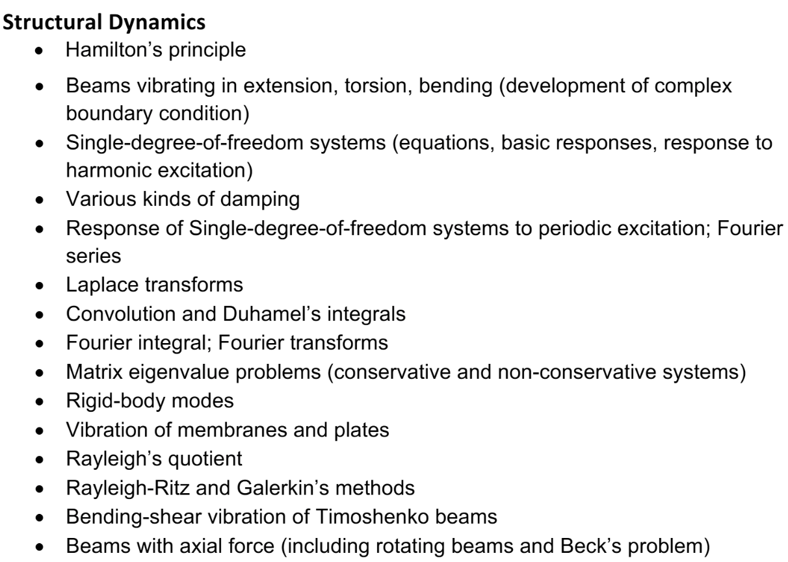

# Dynamics and Structural Dynamics Quals Study

# Dynamics

* [**Dr. Patil's Dynamic Website**](https://sites.gatech.edu/mpatil/dynamics/)

---

## A8 Transonic Flow (June 15, 2024) (Place Holders only)

[Video - Transonic Flow I](https://www.youtube.com/watch?v=uTkk97AETco)
* [MK PPT - Transonic Flow](https://gtvault-my.sharepoint.com/:p:/g/personal/mku7_gatech_edu/EcTPWctxpX9LiJaMwVWixzkBhRGV4dNKmC1Kln5WvglWUQ?e=fbUe20)

---

---

# Structural Dynamics

Videos by Dr. Riso

1. [Video - Intro to Structural Dynamics 8-22-2023](https://gtvault-my.sharepoint.com/:v:/g/personal/mku7_gatech_edu/ERFTsfOPlW9CtJ9PBjvF6jUBCcnCCLuj0NLvM73YMRHPjQ?nav=eyJyZWZlcnJhbEluZm8iOnsicmVmZXJyYWxBcHAiOiJPbmVEcml2ZUZvckJ1c2luZXNzIiwicmVmZXJyYWxBcHBQbGF0Zm9ybSI6IldlYiIsInJlZmVycmFsTW9kZSI6InZpZXciLCJyZWZlcnJhbFZpZXciOiJNeUZpbGVzTGlua0NvcHkifX0&e=bedSdb) (June 3, 2024 Watched)

2. [Video - SDOF Free Response 8-24-2023](https://gtvault-my.sharepoint.com/:v:/g/personal/mku7_gatech_edu/Ef0vYxd7srRMnuhmGwNoNB8BSCI7qa0FIJBahYWPqpJxVQ?nav=eyJyZWZlcnJhbEluZm8iOnsicmVmZXJyYWxBcHAiOiJPbmVEcml2ZUZvckJ1c2luZXNzIiwicmVmZXJyYWxBcHBQbGF0Zm9ybSI6IldlYiIsInJlZmVycmFsTW9kZSI6InZpZXciLCJyZWZlcnJhbFZpZXciOiJNeUZpbGVzTGlua0NvcHkifX0&e=JBsiwS) (June 4, 2024 Watched)

3. [Video - Forced Harmonic SDOF 8-29-2023](https://gtvault-my.sharepoint.com/:v:/g/personal/mku7_gatech_edu/Ef0vYxd7srRMnuhmGwNoNB8BSCI7qa0FIJBahYWPqpJxVQ?nav=eyJyZWZlcnJhbEluZm8iOnsicmVmZXJyYWxBcHAiOiJPbmVEcml2ZUZvckJ1c2luZXNzIiwicmVmZXJyYWxBcHBQbGF0Zm9ybSI6IldlYiIsInJlZmVycmFsTW9kZSI6InZpZXciLCJyZWZlcnJhbFZpZXciOiJNeUZpbGVzTGlua0NvcHkifX0&e=JBsiwS) (June 5, 2024 Watched)

4. [Video - SDOF FRF complex functions 8-31-2023 Part A](https://gtvault-my.sharepoint.com/:v:/g/personal/mku7_gatech_edu/EUPZeSoOb8ZKjCTA_Ie-GIwBqQUAI9i2r7qx0Vf_7A4U1g?nav=eyJyZWZlcnJhbEluZm8iOnsicmVmZXJyYWxBcHAiOiJPbmVEcml2ZUZvckJ1c2luZXNzIiwicmVmZXJyYWxBcHBQbGF0Zm9ybSI6IldlYiIsInJlZmVycmFsTW9kZSI6InZpZXciLCJyZWZlcnJhbFZpZXciOiJNeUZpbGVzTGlua0NvcHkifX0&e=4N7DXQ) (June 6, 2024 Watched)

5. [Video - Damping 8-31-2023 Part B](https://gtvault-my.sharepoint.com/:v:/g/personal/mku7_gatech_edu/EfSw0nDiwVtCv-g15rdxoKkB6NBM32MgxoQ1emH324iK8g?nav=eyJyZWZlcnJhbEluZm8iOnsicmVmZXJyYWxBcHAiOiJPbmVEcml2ZUZvckJ1c2luZXNzIiwicmVmZXJyYWxBcHBQbGF0Zm9ybSI6IldlYiIsInJlZmVycmFsTW9kZSI6InZpZXciLCJyZWZlcnJhbFZpZXciOiJNeUZpbGVzTGlua0NvcHkifX0&e=eA6Fzi) (June 6, 2024 Watched)

6. [Video - Fourier Series Periodic Response 9-05-2023](https://gtvault-my.sharepoint.com/:v:/g/personal/mku7_gatech_edu/EU226yYFDh9Ftw-_0_dugq0B3hehhOWpkA2JHziCYDmttQ?nav=eyJyZWZlcnJhbEluZm8iOnsicmVmZXJyYWxBcHAiOiJPbmVEcml2ZUZvckJ1c2luZXNzIiwicmVmZXJyYWxBcHBQbGF0Zm9ybSI6IldlYiIsInJlZmVycmFsTW9kZSI6InZpZXciLCJyZWZlcnJhbFZpZXciOiJNeUZpbGVzTGlua0NvcHkifX0&e=fgUi2p) (June 8, 2024 Watched)

7. [Video - Laplace transform unit impulse 9-07-2023](https://gtvault-my.sharepoint.com/:v:/g/personal/mku7_gatech_edu/Efmx0NaJ4gtJj1MV6EzYUKwB_0VA_jfHiHGk-NlXgeQlVw?nav=eyJyZWZlcnJhbEluZm8iOnsicmVmZXJyYWxBcHAiOiJPbmVEcml2ZUZvckJ1c2luZXNzIiwicmVmZXJyYWxBcHBQbGF0Zm9ybSI6IldlYiIsInJlZmVycmFsTW9kZSI6InZpZXciLCJyZWZlcnJhbFZpZXciOiJNeUZpbGVzTGlua0NvcHkifX0&e=UNQQau) (June 8, 2024 Watched)

8. [Video - Convolution Duhamel's Integral, Impulse, Step, Ramp 9-12-2023](https://gtvault-my.sharepoint.com/:v:/g/personal/mku7_gatech_edu/Ec5ueM1N2_VKuMA9IsisV8gBdAO7bXQotvzwQEzqvLfZmQ?nav=eyJyZWZlcnJhbEluZm8iOnsicmVmZXJyYWxBcHAiOiJPbmVEcml2ZUZvckJ1c2luZXNzIiwicmVmZXJyYWxBcHBQbGF0Zm9ybSI6IldlYiIsInJlZmVycmFsTW9kZSI6InZpZXciLCJyZWZlcnJhbFZpZXciOiJNeUZpbGVzTGlua0NvcHkifX0&e=9ntxv9) (June 10, 2024 Watched)

9. [Video - Arbitrary Loads - Fourier Transform 9-14-2023](https://gtvault-my.sharepoint.com/:v:/g/personal/mku7_gatech_edu/EScAprSwUzpNl90aXnv6k7cBYswyOIOYek4QSQOVUaLwlw?nav=eyJyZWZlcnJhbEluZm8iOnsicmVmZXJyYWxBcHAiOiJPbmVEcml2ZUZvckJ1c2luZXNzIiwicmVmZXJyYWxBcHBQbGF0Zm9ybSI6IldlYiIsInJlZmVycmFsTW9kZSI6InZpZXciLCJyZWZlcnJhbFZpZXciOiJNeUZpbGVzTGlua0NvcHkifX0&e=ce648M) (June 11, 2024 Watched)

10. [Video - MDOF - Newton 9-19-2023](https://gtvault-my.sharepoint.com/:v:/g/personal/mku7_gatech_edu/EZAdVzXEJvlDtTCcr2K3xNYBKge9AtrbnNrhzx2Yfb-2Tg?nav=eyJyZWZlcnJhbEluZm8iOnsicmVmZXJyYWxBcHAiOiJPbmVEcml2ZUZvckJ1c2luZXNzIiwicmVmZXJyYWxBcHBQbGF0Zm9ybSI6IldlYiIsInJlZmVycmFsTW9kZSI6InZpZXciLCJyZWZlcnJhbFZpZXciOiJNeUZpbGVzTGlua0NvcHkifX0&e=p25Kd9) (June 12, 2024 Watched)

11. [Video - MDOF examples (Newton Method) 9-21-2023](https://gtvault-my.sharepoint.com/:v:/g/personal/mku7_gatech_edu/EbUQcCoEO2FPonEiPzZmiK0BCAldPHHukpSvNed0C5PTGw?nav=eyJyZWZlcnJhbEluZm8iOnsicmVmZXJyYWxBcHAiOiJPbmVEcml2ZUZvckJ1c2luZXNzIiwicmVmZXJyYWxBcHBQbGF0Zm9ybSI6IldlYiIsInJlZmVycmFsTW9kZSI6InZpZXciLCJyZWZlcnJhbFZpZXciOiJNeUZpbGVzTGlua0NvcHkifX0&e=ShJYj3) (June 13, 2024 Watched)

12. [Video - Lagrange's Equation 9-26-2023](https://gtvault-my.sharepoint.com/:v:/g/personal/mku7_gatech_edu/EUIU9ZO_0btLtvQyLvhaZhIBAlc8IiRj0m3BOGvjoS3lXg?nav=eyJyZWZlcnJhbEluZm8iOnsicmVmZXJyYWxBcHAiOiJPbmVEcml2ZUZvckJ1c2luZXNzIiwicmVmZXJyYWxBcHBQbGF0Zm9ybSI6IldlYiIsInJlZmVycmFsTW9kZSI6InZpZXciLCJyZWZlcnJhbFZpZXciOiJNeUZpbGVzTGlua0NvcHkifX0&e=zhEl4E) (June 14, 2024 Watched)

13. [Video - MDOF Lagrange's Equation Examples, Synchronous Motion 9-28-2023](https://gtvault-my.sharepoint.com/:v:/g/personal/mku7_gatech_edu/ESFDav8Qq4FGug1UuO_Uov8BQwgBFaEtmVP92Lgvemq0tA?nav=eyJyZWZlcnJhbEluZm8iOnsicmVmZXJyYWxBcHAiOiJPbmVEcml2ZUZvckJ1c2luZXNzIiwicmVmZXJyYWxBcHBQbGF0Zm9ybSI6IldlYiIsInJlZmVycmFsTW9kZSI6InZpZXciLCJyZWZlcnJhbFZpZXciOiJNeUZpbGVzTGlua0NvcHkifX0&e=krmAE4) (June 17, 2024 Watched)

14. [Video - MDOF Synchronous Motion Modal Analysis Derivation Eigenvalue Problem 10-3-2023](https://gtvault-my.sharepoint.com/:v:/g/personal/mku7_gatech_edu/ES1E5URu2jdCrOEKrjGEGgsBXCv8FA-kTVtM_At02ASCKA?nav=eyJyZWZlcnJhbEluZm8iOnsicmVmZXJyYWxBcHAiOiJPbmVEcml2ZUZvckJ1c2luZXNzIiwicmVmZXJyYWxBcHBQbGF0Zm9ybSI6IldlYiIsInJlZmVycmFsTW9kZSI6InZpZXciLCJyZWZlcnJhbFZpZXciOiJNeUZpbGVzTGlua0NvcHkifX0&e=GHDUpm) (June 18, 2024 Watched)

15. [Video - MDOF Modal Analysis Orthogonality, Example 10-12-2023](https://gtvault-my.sharepoint.com/:v:/g/personal/mku7_gatech_edu/ESLU-bw2RSFBhJBkbGKlkIwBLp6tTt2xtcbnAT3eMSr-cA?nav=eyJyZWZlcnJhbEluZm8iOnsicmVmZXJyYWxBcHAiOiJPbmVEcml2ZUZvckJ1c2luZXNzIiwicmVmZXJyYWxBcHBQbGF0Zm9ybSI6IldlYiIsInJlZmVycmFsTW9kZSI6InZpZXciLCJyZWZlcnJhbFZpZXciOiJNeUZpbGVzTGlua0NvcHkifX0&e=vpDXj5) (June 19, 2024 Watched)

16. [Video - MDOF Modal Analysis Solve Synchronous Motion, Intro to Damping 10-17-2023](https://gtvault-my.sharepoint.com/:v:/g/personal/mku7_gatech_edu/Eamf3ohxb_1HkIRFO4PVxswBX20cGiRv8id-sVQsogN3xw?nav=eyJyZWZlcnJhbEluZm8iOnsicmVmZXJyYWxBcHAiOiJPbmVEcml2ZUZvckJ1c2luZXNzIiwicmVmZXJyYWxBcHBQbGF0Zm9ybSI6IldlYiIsInJlZmVycmFsTW9kZSI6InZpZXciLCJyZWZlcnJhbFZpZXciOiJNeUZpbGVzTGlua0NvcHkifX0&e=8dzqYR) (June 20, 2024 Watched)

17. [Video - MDOF Modal Analysis with Damping, Forced Response 10-19-2023](https://gtvault-my.sharepoint.com/:v:/g/personal/mku7_gatech_edu/EUKhOI4HABRGh6tywcXIs0wBcCSt_PVffN5nR9ILbhVVgQ?nav=eyJyZWZlcnJhbEluZm8iOnsicmVmZXJyYWxBcHAiOiJPbmVEcml2ZUZvckJ1c2luZXNzIiwicmVmZXJyYWxBcHBQbGF0Zm9ybSI6IldlYiIsInJlZmVycmFsTW9kZSI6InZpZXciLCJyZWZlcnJhbFZpZXciOiJNeUZpbGVzTGlua0NvcHkifX0&e=FHUwVW) (June 21, 2024 Watched)

18. [Video - Continuous System Intro, Hamilton's Principle, Wing Example 10-24-2023](https://gtvault-my.sharepoint.com/:v:/g/personal/mku7_gatech_edu/EdEG97BgJnZIle4-0Z5s27IBA-NE6co1-T81bIv59Lxu6A?nav=eyJyZWZlcnJhbEluZm8iOnsicmVmZXJyYWxBcHAiOiJPbmVEcml2ZUZvckJ1c2luZXNzIiwicmVmZXJyYWxBcHBQbGF0Zm9ybSI6IldlYiIsInJlZmVycmFsTW9kZSI6InZpZXciLCJyZWZlcnJhbFZpZXciOiJNeUZpbGVzTGlua0NvcHkifX0&e=SEbm1T) (June 22, 2024 Watched)

19. [Video - String Governing Equation (Hamilton's Principle) 10-26-2023](https://gtvault-my.sharepoint.com/:v:/g/personal/mku7_gatech_edu/ESoRr6oPgh5PgJtza_fwXzgBA1qB1zZJmb4MYuWippxHEA?nav=eyJyZWZlcnJhbEluZm8iOnsicmVmZXJyYWxBcHAiOiJPbmVEcml2ZUZvckJ1c2luZXNzIiwicmVmZXJyYWxBcHBQbGF0Zm9ybSI6IldlYiIsInJlZmVycmFsTW9kZSI6InZpZXciLCJyZWZlcnJhbFZpZXciOiJNeUZpbGVzTGlua0NvcHkifX0&e=UinvU2) (June 24, 2024 Watched)

20. [Video - String Synchronous Solution, Eigenvalue, Eigenfunction, Mode Shape 10-31-2023](https://gtvault-my.sharepoint.com/:v:/g/personal/mku7_gatech_edu/ES9ygb_W0N5DkbC31xewBO8BSqUW_v9U6ppIQ6ISq49ryg?nav=eyJyZWZlcnJhbEluZm8iOnsicmVmZXJyYWxBcHAiOiJPbmVEcml2ZUZvckJ1c2luZXNzIiwicmVmZXJyYWxBcHBQbGF0Zm9ybSI6IldlYiIsInJlZmVycmFsTW9kZSI6InZpZXciLCJyZWZlcnJhbFZpZXciOiJNeUZpbGVzTGlua0NvcHkifX0&e=SwE3a0) (June 26, 2024 Watched)

21. [Video - Beam Axial and Torsional Vibration 11-02-2023](https://gtvault-my.sharepoint.com/:v:/g/personal/mku7_gatech_edu/EYspgL_PgvpHirdQ82pmmtwB7SZWqMgCUW60R3LFcW6uEQ?nav=eyJyZWZlcnJhbEluZm8iOnsicmVmZXJyYWxBcHAiOiJPbmVEcml2ZUZvckJ1c2luZXNzIiwicmVmZXJyYWxBcHBQbGF0Zm9ybSI6IldlYiIsInJlZmVycmFsTW9kZSI6InZpZXciLCJyZWZlcnJhbFZpZXciOiJNeUZpbGVzTGlua0NvcHkifX0&e=ypuLs7) (June 27, 2024 Watched)

22. [Video - Beam in torsion and beam in bending 11-07-2023](https://gtvault-my.sharepoint.com/:v:/g/personal/mku7_gatech_edu/EeFSYVbZZbBJlNx0wGvmf0cBVFd-hMK9VTnJE7zklOf0zw?nav=eyJyZWZlcnJhbEluZm8iOnsicmVmZXJyYWxBcHAiOiJPbmVEcml2ZUZvckJ1c2luZXNzIiwicmVmZXJyYWxBcHBQbGF0Zm9ybSI6IldlYiIsInJlZmVycmFsTW9kZSI6InZpZXciLCJyZWZlcnJhbFZpZXciOiJNeUZpbGVzTGlua0NvcHkifX0&e=k4dgw5) (July 2, 2024 Watched)

23. [Video - Beam in Bending Solution and Boundary Conditions 11-09-2023](https://gtvault-my.sharepoint.com/:v:/g/personal/mku7_gatech_edu/EcUA_HJzAVhFtsO40jvnT3gBIZn_12FYJStu1t3HSkEDEA?nav=eyJyZWZlcnJhbEluZm8iOnsicmVmZXJyYWxBcHAiOiJPbmVEcml2ZUZvckJ1c2luZXNzIiwicmVmZXJyYWxBcHBQbGF0Zm9ybSI6IldlYiIsInJlZmVycmFsTW9kZSI6InZpZXciLCJyZWZlcnJhbFZpZXciOiJNeUZpbGVzTGlua0NvcHkifX0&e=GelYkk) (July 3, 2024 Watched)

24. [Video - 11-14-2023](https://gtvault-my.sharepoint.com/:v:/g/personal/mku7_gatech_edu/Ef1yokjqd05EqQDbdwHogJoBgDD2HnXKdHyr0jWnIHYZeA?nav=eyJyZWZlcnJhbEluZm8iOnsicmVmZXJyYWxBcHAiOiJPbmVEcml2ZUZvckJ1c2luZXNzIiwicmVmZXJyYWxBcHBQbGF0Zm9ybSI6IldlYiIsInJlZmVycmFsTW9kZSI6InZpZXciLCJyZWZlcnJhbFZpZXciOiJNeUZpbGVzTGlua0NvcHkifX0&e=fcaKbv)

25. [Video - 11-16-2023](https://gtvault-my.sharepoint.com/:v:/g/personal/mku7_gatech_edu/EbRU4IhZ9f9PiND4ADD8e3MBkU1UUNZbdLh6ZpZPODIXTw?nav=eyJyZWZlcnJhbEluZm8iOnsicmVmZXJyYWxBcHAiOiJPbmVEcml2ZUZvckJ1c2luZXNzIiwicmVmZXJyYWxBcHBQbGF0Zm9ybSI6IldlYiIsInJlZmVycmFsTW9kZSI6InZpZXciLCJyZWZlcnJhbFZpZXciOiJNeUZpbGVzTGlua0NvcHkifX0&e=f6FKZs)

26. [Video - 11-21-2023](https://gtvault-my.sharepoint.com/:v:/g/personal/mku7_gatech_edu/EUUlelQoTjJCmpIYLRwL-c0Bvavn0kmSGrUq86YpKne5Sw?nav=eyJyZWZlcnJhbEluZm8iOnsicmVmZXJyYWxBcHAiOiJPbmVEcml2ZUZvckJ1c2luZXNzIiwicmVmZXJyYWxBcHBQbGF0Zm9ybSI6IldlYiIsInJlZmVycmFsTW9kZSI6InZpZXciLCJyZWZlcnJhbFZpZXciOiJNeUZpbGVzTGlua0NvcHkifX0&e=bXpSWz)

27. [Video - 11-28-2023](https://gtvault-my.sharepoint.com/:v:/g/personal/mku7_gatech_edu/EV4PT5Z2ZYJEpxzd3tqXvRkBP45MoWYRel2u07OdUma0Fw?nav=eyJyZWZlcnJhbEluZm8iOnsicmVmZXJyYWxBcHAiOiJPbmVEcml2ZUZvckJ1c2luZXNzIiwicmVmZXJyYWxBcHBQbGF0Zm9ybSI6IldlYiIsInJlZmVycmFsTW9kZSI6InZpZXciLCJyZWZlcnJhbFZpZXciOiJNeUZpbGVzTGlua0NvcHkifX0&e=hYQCvo)

28. [Video - 11-30-2023](https://gtvault-my.sharepoint.com/:v:/g/personal/mku7_gatech_edu/EaTbaVCI9x1MuBvkpi_nLQQByXE92lwjzS7Ff5bR54jEEg?nav=eyJyZWZlcnJhbEluZm8iOnsicmVmZXJyYWxBcHAiOiJPbmVEcml2ZUZvckJ1c2luZXNzIiwicmVmZXJyYWxBcHBQbGF0Zm9ybSI6IldlYiIsInJlZmVycmFsTW9kZSI6InZpZXciLCJyZWZlcnJhbFZpZXciOiJNeUZpbGVzTGlua0NvcHkifX0&e=4IFF6x)

29. [Video - 12-05-2023](https://gtvault-my.sharepoint.com/:v:/g/personal/mku7_gatech_edu/ESBKUQ8dP-tHqYok8fo9U_IBPxDX2AE71IfWFGHZflfVAg?nav=eyJyZWZlcnJhbEluZm8iOnsicmVmZXJyYWxBcHAiOiJPbmVEcml2ZUZvckJ1c2luZXNzIiwicmVmZXJyYWxBcHBQbGF0Zm9ybSI6IldlYiIsInJlZmVycmFsTW9kZSI6InZpZXciLCJyZWZlcnJhbFZpZXciOiJNeUZpbGVzTGlua0NvcHkifX0&e=UqYobD)

